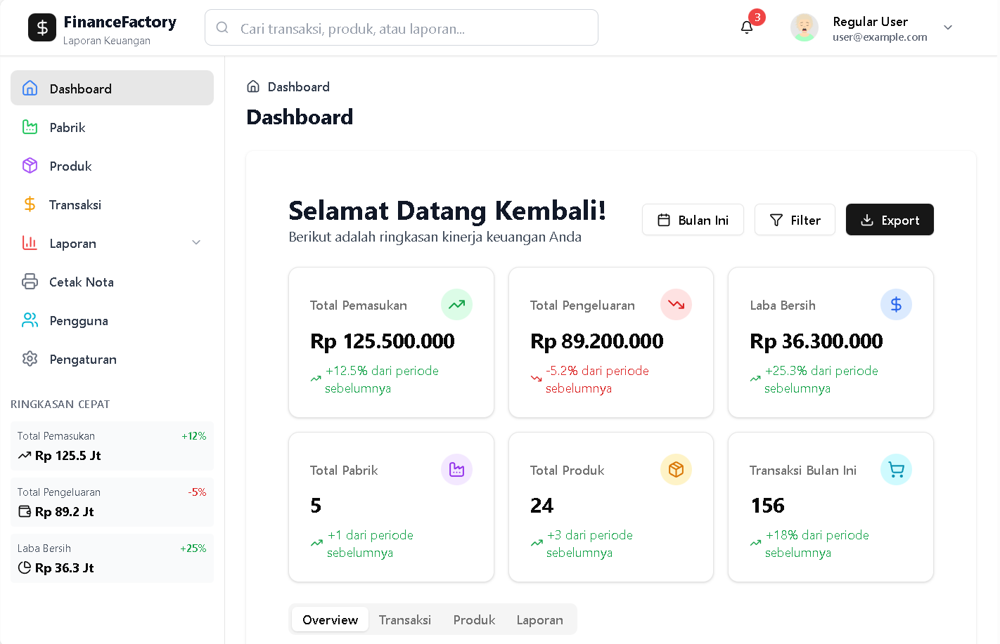

# Laporan Keuangan Sederhana, dengan Fitur :
Login dan Register
Daftar Pabrik
Daftar Produk
Pemasukan dan Pengeluaran
Report Harian dan Bulanan
Cetak Nota

# Rencana Teknis
Frontend: Vite + ReactJS + TypeScript + Tailwind CSS + shadcn/ui

Backend Dummy: JSON Server atau mock API

Authentication: Dummy login dengan data statis

Database Simulasi: LocalStorage atau JSON file

## Screenshot

## Getting Started

### Prerequisites
- Node.js (v16 or later)
- npm (v8 or later)

### Install dependencies
npm install

### Development dengan frontend dan backend
npm run dev:full

### Atau secara terpisah:
### Terminal 1: Frontend
npm run dev

### Terminal 2: Backend dummy
npm run server